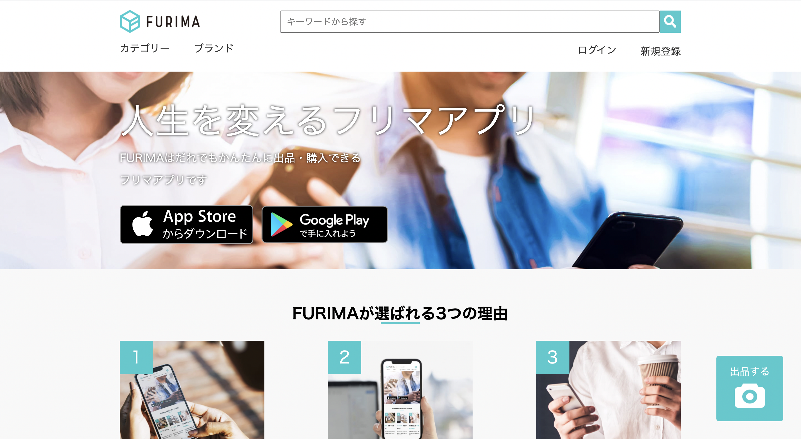

# Portfolio name : FURIMA

誰でも売りたい商品を投稿し自分の出し値をつける。その投稿した商品を観覧者が購入できる、アプリケーションです。

# Url: https://furima-29649.herokuapp.com

# ID/Pass

* ID: kazugo
* Pass: 0634
* テスト用アカウント
  購入者用
    メールアドレス: coffee@gmail.com
    パスワード: coffee3150
  
  購入用カード情報
    番号：4242424242424242
    期限：3月25年
    セキュリティコード：123
  
  出品者用
    メールアドレス名: sutaba@gmail.com
    パスワード: sutaba3150

* Githubリポジトリ: https://github.com/yamakazugo/furima-29649

# Demo(動画)

*ユーザー管理機能

*商品出品機能

https://i.gyazo.com/95d67f439ddb8d4e9cda7a104f96df6d.gif

*商品購入機能

https://i.gyazo.com/960db16fd4e3529ecb0383dd9bd877d3.gif

# テーブル設計

## users テーブル

| Column             | Type      | Options     |
| ------------------ | ------    | ----------- |
| nickname           | string    | null: false |
| email              | string    | null: false |
| encrypted_password | string    | null: false |
| first_name         | string    | null: false |
| last_name          | string    | null: false |
| first_name_kana    | string    | null: false |
| last_name_kana     | string    | null: false |
| birthday           | date      | null: false |

### Association

- has_many :items
- has_many :purchase

## items テーブル
| Column                | Type       | Options                        |
| ---------------       | ---------- | ------------------------------ |
| item_name             | string     | null: false                    |
| explain               | text       | null: false                    |
| category_id           | integer    | null: false                    |
| item_condition_id     | integer    | null: false                    |
| delivery_feed_id      | integer    | null: false                    |
| shipping_origin_id    | integer    | null: false                    |
| day_until_shipping_id | integer    | null: false                    |
| price                 | integer    | null: false                    |
| user                  | references | null: false, foreign_key: true |

### Association

- belongs_to :user
- has_one :purchase

## address テーブル

| Column        | Type        | Options                        |
| -------       | ----------  | ------------------------------ |
| post_code     | string      | null: false                    |
| prefecture_id | integer     | null: false                    |
| city          | string      | null: false                    |
| house_number  | string      | null: false                    |
| building_name | string      |                                |
| phone_number  | string      | null: false                    |
| purchase      | references  | null: false, foreign_key: true |

### Association

- belongs_to :purchase

## purchase テーブル

 Column         |  Type      | Options                        |
| -------       | ---------- | ------------------------------ |
| user          | references | null: false, foreign_key: true |
| item          | references | null: false, foreign_key: true |

### Association

- belongs_to :user
- belongs_to :item
- has_one :address

